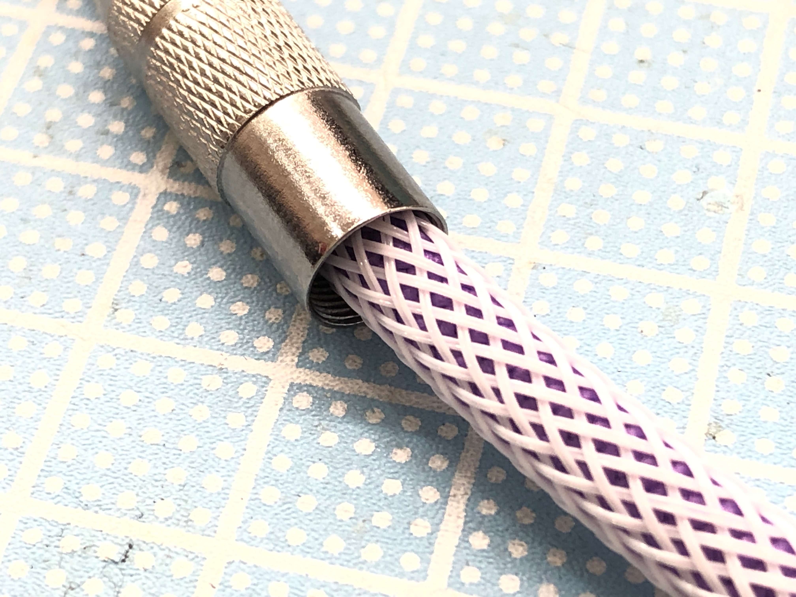

# DIY TRRS cable guide

[日本語版](README.md)

## Kit contents
 - TRRS plug * 2
 - 4-core cable
 - Paracord
 - Cable sheath
 - Heat-shrink tube * 2

## Required tools
 - Soldering iron
 - Solder
 - Solder wick
 - Wire cutters
 - Needle-nose pliers
 - Cutter
 - Masking tape
 - A heat source like a heat gun

## Other useful items:
 - Polyimide tape (Kapton tape)

## 1: Remove the white thread from inside the paracord

## 2: Pass the 4-core cable through the paracord

## 3: Tape the edges of the paracord and cable with masking tape to prevent fraying

## 4: Pass the paracord-cable combination from step 3 through the cable sheath

        *Ensure that the cable sheath and paracord are tightly stretched around the cable

## 5: The cable sheath also frays easily, so hold it down with masking tape

## 6: Take off the metal housing from the 4-contact plug

## 7: Pass the result from step 5 through the metal housing and then the heat-shrink tubes

        *Ensure the screw threads on the metal housing point outwards as shown

## 8: Remove the masking tape from step 3 and cut the paracord and cable sheath to your desired length

## 9: Strip about 2cm of the grey covering from the 4-core cable

## 10: Strip each wire to match the lengths of each contact of the plug

         *Remember to take note of what color wire connects to which contact. In this photo, from shortest to longest contact, we solder green, white, yellow and brown.

## 11: Confirm once again that the metal housings and heat shrink tubes have been passed over the cable

## 12: Solder each of the wires to their contacts

        *Ensure you've taken note to match up the wire colors and contacts.

        *If you have heat-resistant polyimide tape, then wrap the top 2 contacts to prevent shorts

## 13: Close the base of the 4-contact plug

## 13: Confirm that the heat shrink tubes and metal housings are on the cable, and repeat the process on the other end

## 14: Using a multimeter, check that the contacts are matched correctly and that there are no shorts

## 15: Using a heat gun, shrink the heat shrink tubes, and screw on the metal housings to finish the cable
        *Remember to remove any masking tape you may have used in step 5 before you shrink the tubing

